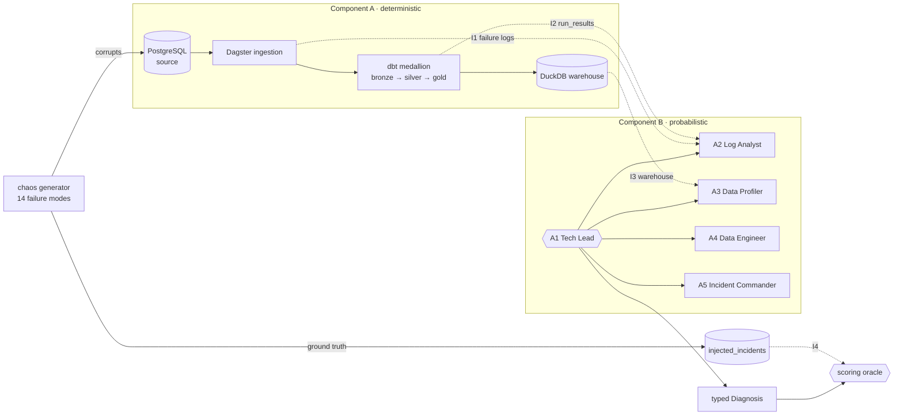

# Sentinel Engine

**English** · [Português](README.pt-br.md)

An **autonomous DataOps crew** that watches an analytical backbone, diagnoses failures
injected into it, and is **graded against a ground-truth ledger** — never asserted correct.
Built with **CrewAI**, **Dagster**, **dbt** and **DuckDB** during my AI Data Engineer
specialization.

It closes a loop the two earlier projects opened: the
[DataOps Knowledge Hub](https://github.com/yagosamu/llamaindex_pydantic_rag) made the data queryable, the
[Quality Guardian](https://github.com/yagosamu/quality-guardian-langgraph) judged its quality and paused for
a human. Here the judgment itself gets judged.

## Why score an agent instead of testing it?

A test asserts a known output. An agent diagnosing an incident has no known output — only a
more or less plausible story. So the system plants failures it already knows the answer to:
a **14-mode chaos generator** corrupts the source and writes each injection to an
`injected_incidents` ledger. The crew never sees that ledger. The oracle does.

Grading runs in two tiers, and the second one is the interesting half:

| Tier | What it measures | Gating? |
|---|---|---|
| **1 · Diagnosis match** | `1.0` exact key · `0.7` registry-justified alias · `0.5–1.0` partial credit on a cascade · `0.0` miss | yes |
| **2 · Evidence quality** | did the diagnosis cite the *correct* evidence surface? | no — reported separately |

Tier 2 exists to catch the failure mode a single score would hide: **a lucky guess**. Name
the right `failure_key` while inventing the reasoning and you score `match=1.0`,
`evidence=0.0` — visibly flagged rather than rewarded. And a run the crew could not finish
returns `NO-RUN`, never a fabricated number.

> **The one-way dependency is enforced, not just documented.**
> Component A emits a stable `BACKBONE_RUN_FAILURE` log line and moves on. It never imports,
> calls, or triggers the crew. From the failure sensor's own source: *"If anyone proposes the
> sensor trigger the Sentinel crew, reject it: the sensor logs, the Sentinel reads."*
> The crew is a reader of exhaust, so the backbone stays shippable without it.

### A cheap tier detects, a strong tier coordinates

The four specialists run on `gpt-4o-mini`; only the manager runs `gpt-4o`. Reading a rejects
table or a dbt error is mechanical — a cheap model does it fine. Weighing two squads of
contradictory evidence into a single verdict is the judgment call, so that step gets the
stronger model. Same reasoning as the Guardian's Haiku-proposes / Sonnet-judges split,
applied to delegation instead of self-correction.

Remediation is **advisory by construction**: A4 writes patches into `sentinel/proposed/` for a
human to apply. A destructive fix pauses for approval before the proposal is even emitted.

## Architecture



A1 is a custom `manager_agent` in a CrewAI **hierarchical** process — it delegates and never
detects. The specialists carry `allow_delegation=False`, so delegation flows one way.

| Agent | Detects | Tools | Surface |
|---|---|---|---|
| **A1 Tech Lead** | — (coordinates, synthesizes one verdict) | none — delegation is structural | — |
| **A2 Log Analyst** | pipeline failures (`schema_drift`, `slow_source`) | `ReadDagsterLogs` · `ReadDbtRunResults` | I1 · I2 |
| **A3 Data Profiler** | data defects (quarantined or flagged) | `ProfileRejects` · `QueryDuckDB` | I3 |
| **A4 Data Engineer** | — (drafts a gated patch, never applies it) | `ProposePatch` | writes B-only |
| **A5 Incident Commander** | repeat offenders; writes the post-mortem | `QueryIncidentRAG` · `WritePostmortem` | I5 |

The investigation squad emits a typed `Diagnosis` (`output_pydantic`), not free text. That
typing is what makes the crew scorable at all.

## Demo

**The medallion quarantines rather than drops.** 9,533 raw orders after a chaos run split
cleanly, and nothing corrupt reached the serving layer:

```
raw_orders                 9,533
  ├─ silver_orders         5,455   accepted
  └─ silver_orders_rejects 4,078   quarantined, stamped with reject_rule
gold_orders_obt            5,455   ← exactly the accepted set
```

**All four acceptance gates, measured on my machine** — `0 SKIP` matters here, because the
suite returns exit code `77` for *unmeasurable* rather than letting a missing precondition
pass silently:

```
  ID        CRITERION                       VERDICT
  --------  ------------------------------  -------
  ac1       AC-1 peak isolation             PASS
  ac2       AC-2 gold p95 <= 5s             PASS
  ac3       AC-3 freshness <= 5min          PASS
  defect    DEFECT survival (U3)            PASS

  totals: 4 PASS  0 FAIL/ERROR  0 SKIP        (elapsed 271s)
OVERALL: PASS — every eval that ran met its criterion.
```

**Defect survival, per failure mode.** Seven defects injected, each caught in the right
quarantine table under its own `reject_rule`, none leaking downstream:

```
--- duplicate_order -> silver.silver_orders_rejects (reject_rule=duplicate_order) ---
  -> injected: duplicated into order_id=5001            (detected by Data Profiler)
  -> caught in silver.silver_orders_rejects:  3154 row(s)
  -> leaked into gold.gold_orders_obt:           0 row(s)
[ PASS ] duplicate_order: defect quarantined and absent from gold.
```

## How the plans were built

The two plans under [`sketch/`](sketch) came out of a four-pass planning relay — intent,
structure, decomposition, then an adversarial consensus pass run on a **different model**
(Codex attacks, Claude defends), because a model reviewing its own plan produces agreement,
not consensus.

That pass surfaced **14 objections**, every one either fixed in the plan text or recorded as
an accepted risk with an owner: AC-2's mapping corrected to include p99 and week-long
sampling; AC-4/AC-5/AC-6 flagged as genuinely uncovered instead of implied done; the RAG
cold-start limitation and the ledger-polling trigger documented as deliberate choices rather
than oversights. The diff on those two files is the record of what consensus changed.

## Stack

Python 3.12 · CrewAI · Dagster · dbt · DuckDB · PostgreSQL 17 · Pydantic · psycopg 3 ·
FastAPI · MCP · uv · Docker · pytest · ruff

## Run

```bash
cp .env.example .env     # add OPENAI_API_KEY (optional — without one the crew
                         # falls back to a deterministic cascade Flow)
make setup               # install dependencies with uv
make up                  # PostgreSQL 17; schema auto-applies on first boot
make seed                # clean baseline: 500 customers / 200 products / 5000 orders

make failures            # list the 14 failure modes
make inject FAILURE=negative_price   # plant one; logged to injected_incidents

make ingest-once         # Dagster ingestion + dbt medallion into DuckDB
uv run python -m sentinel.trigger --since "2026-06-30T00:00:00+00:00"   # dispatch the crew
make evals               # all four acceptance gates, with a verdict table
make dagster-dev         # or: the asset graph at http://localhost:3000
```

> **Windows note.** The `Makefile` detects the platform and points `SHELL` at Git Bash, and
> quotes every path it passes. Both are needed: GNU Make bypasses `SHELL` entirely for
> recipes without shell metacharacters, running them through `CreateProcess` — where
> `mkdir -p` does not exist and `bash` resolves to the WSL stub.
