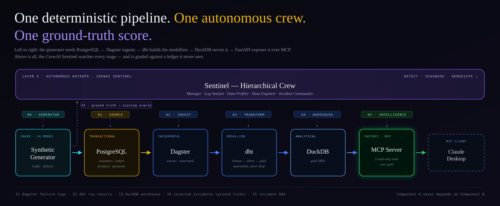
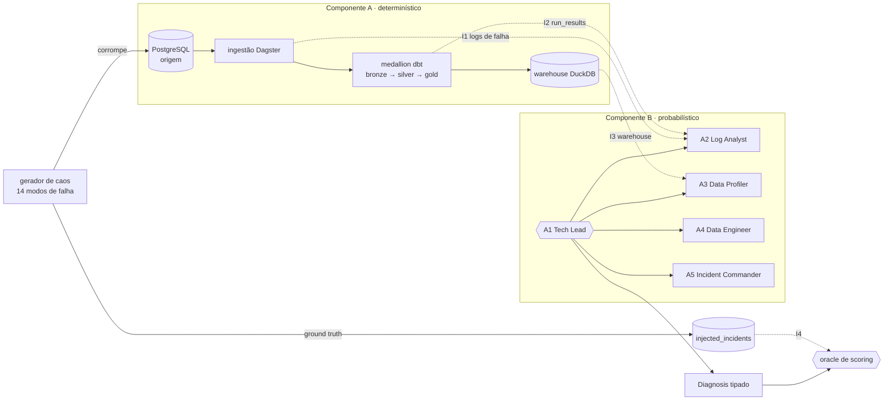

# Sentinel Engine

[English](README.md) · **Português**



Um **time autônomo de DataOps** que observa uma espinha dorsal analítica, diagnostica falhas
injetadas nela e é **pontuado contra um ledger de ground truth**, nunca dado como correto
por afirmação. Construído com **CrewAI**, **Dagster**, **dbt** e **DuckDB**.

Ele fecha um ciclo que os dois projetos anteriores abriram: o
[DataOps Knowledge Hub](https://github.com/yagosamu/llamaindex_pydantic_rag/blob/main/README.pt-br.md) tornou o dado
consultável, o [Quality Guardian](https://github.com/yagosamu/quality-guardian-langgraph/blob/main/README.pt-br.md) julgou sua
qualidade e pausou para um humano. Aqui o próprio julgamento passa a ser julgado.

## Por que pontuar um agente em vez de testá-lo?

Um teste afirma uma saída conhecida. Um agente diagnosticando um incidente não tem saída
conhecida, só uma história mais ou menos plausível. Então o sistema planta falhas cuja
resposta ele já sabe: um **gerador de caos com 14 modos** corrompe a origem e grava cada
injeção num ledger `injected_incidents`. O time nunca vê esse ledger. O oracle vê.

A avaliação roda em dois tiers, e o segundo é a metade interessante:

| Tier | O que mede | Bloqueia? |
|---|---|---|
| **1 · Diagnosis match** | `1.0` chave exata · `0.7` alias justificado no registro · `0.5–1.0` crédito parcial em cascata · `0.0` erro | sim |
| **2 · Qualidade da evidência** | o diagnóstico citou a superfície de evidência *correta*? | não — reportado à parte |

O Tier 2 existe para pegar o modo de falha que uma nota única esconderia: **o chute com
sorte**. Acertar o `failure_key` inventando o raciocínio resulta em `match=1.0`,
`evidence=0.0`, sinalizado à vista, não premiado. E uma execução que o time não conseguiu
concluir retorna `NO-RUN`, jamais um número fabricado.

> **A dependência de mão única é imposta, não só documentada.**
> O Componente A emite uma linha de log estável `BACKBONE_RUN_FAILURE` e segue em frente.
> Ele nunca importa, chama ou dispara o time. Do próprio código do sensor de falha:
> *"Se alguém propuser que o sensor dispare o time Sentinel, rejeite: o sensor registra, o
> Sentinel lê."* O time só lê o escapamento, então a espinha dorsal continua entregável sem ele.

### Um tier barato detecta, um tier forte coordena

Os quatro especialistas rodam em `gpt-4o-mini`; só o gerente roda `gpt-4o`. Ler uma tabela de
rejects ou um erro de dbt é mecânico, um modelo barato dá conta. Ponderar dois esquadrões de
evidência contraditória em um veredito único é a decisão de juízo, então esse passo recebe o
modelo mais forte. Mesmo raciocínio da divisão Haiku-propõe / Sonnet-julga do Guardian,
aplicado a delegação em vez de auto-correção.

A remediação é **consultiva por construção**: o A4 escreve patches em `sentinel/proposed/`
para um humano aplicar. Uma correção destrutiva pausa para aprovação antes mesmo de a
proposta ser emitida.

## Arquitetura



O A1 é um `manager_agent` customizado num processo **hierárquico** do CrewAI, e ele delega mas
nunca detecta. Os especialistas têm `allow_delegation=False`, então a delegação flui num
sentido só.

| Agente | Detecta | Ferramentas | Superfície |
|---|---|---|---|
| **A1 Tech Lead** | — (coordena, sintetiza um veredito) | nenhuma — delegação é estrutural | — |
| **A2 Log Analyst** | falhas de pipeline (`schema_drift`, `slow_source`) | `ReadDagsterLogs` · `ReadDbtRunResults` | I1 · I2 |
| **A3 Data Profiler** | defeitos de dado (em quarentena ou flagados) | `ProfileRejects` · `QueryDuckDB` | I3 |
| **A4 Data Engineer** | — (rascunha patch gated, nunca aplica) | `ProposePatch` | escreve só em B |
| **A5 Incident Commander** | reincidências; escreve o post-mortem | `QueryIncidentRAG` · `WritePostmortem` | I5 |

O esquadrão de investigação emite um `Diagnosis` tipado (`output_pydantic`), não texto livre.
É essa tipagem que torna o time pontuável.

## Como os planos foram construídos

Os dois planos em [`sketch/`](sketch) saíram de um revezamento de planejamento em quatro
passes: intenção, estrutura, decomposição e então um passe de consenso adversarial rodado em
um **modelo diferente** (Codex ataca, Claude defende), porque um modelo revisando o próprio
plano produz concordância, não consenso.

Esse passe levantou **14 objeções**, cada uma corrigida no texto do plano ou registrada como
risco aceito com dono: o mapeamento do AC-2 corrigido para incluir p99 e amostragem semanal;
AC-4/AC-5/AC-6 sinalizados como genuinamente não cobertos em vez de implicitamente prontos; a
limitação de cold-start do RAG e o gatilho por polling do ledger documentados como escolhas
deliberadas, não descuidos. O diff desses dois arquivos é o registro do que o consenso mudou.

## Stack

Python 3.12 · CrewAI · Dagster · dbt · DuckDB · PostgreSQL 17 · Pydantic · psycopg 3 ·
FastAPI · MCP · uv · Docker · pytest · ruff

## Executar

```bash
cp .env.example .env     # coloque sua OPENAI_API_KEY (opcional, sem ela o time
                         # cai num Flow de cascata determinístico)
make setup               # instala as dependências com uv
make up                  # PostgreSQL 17; schema aplicado no primeiro boot
make seed                # baseline limpo: 500 customers / 200 products / 5000 orders

make failures            # lista os 14 modos de falha
make inject FAILURE=negative_price   # planta um; registrado em injected_incidents

make ingest-once         # ingestão Dagster + medallion dbt no DuckDB
uv run python -m sentinel.trigger --since "2026-06-30T00:00:00+00:00"   # dispara o time
make evals               # os quatro portões de aceite, com tabela de veredito
make dagster-dev         # ou: o grafo de assets em http://localhost:3000
```

> **Nota para Windows.** O `Makefile` detecta a plataforma e aponta `SHELL` para o Git Bash,
> além de colocar aspas em todo path que passa. As duas coisas são necessárias: o GNU Make
> ignora o `SHELL` por completo em recipes sem metacaracteres de shell, executando-os via
> `CreateProcess`, onde `mkdir -p` não existe e `bash` resolve para o stub do WSL.
